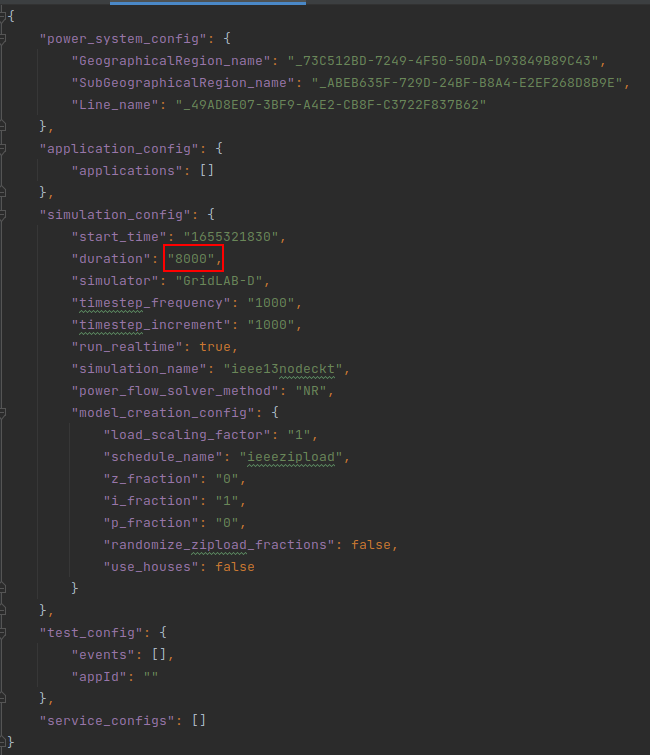
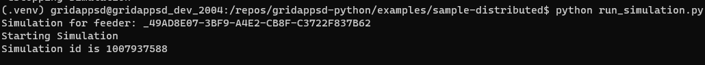

# Sample Distributed Field Bus Application

The default configuration is for the 13nodeckt from gridappsd with 8000 seconds of real time simulation.  You 
can finde the following file in [sample-distributed/config_files_simulated/simulation-config.json](config_files_simulated/simulation-config.json) 
should you want to change it.



In order to run this example you will need to have gridappsd running.  Follow instructions at gridappsd-docker repository.

Modify auth_context.py with the correct values for the different environmental variables.  These will be used
to overwrite the values in the different yaml configuration files for connecting to gridappsd as field bus.

Open 2 command terminals with an environment containing the gridappsd-python version.

```commandline
# Command line 1 holds the simulation running
python run_simulation.py
```


```commandline
# Command line 1 holds the simulation running
python run_simulation.py
```


You can see the creation and retrieval of all the messages on the different levels.
